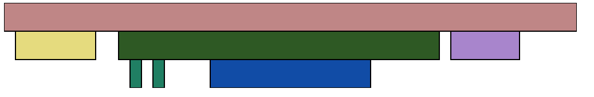

Progress
========

This documents both the evolution of the visualization, as well as (at least in
the beginning), my learning ``d3.js``.

February 18, 2012
-----------------

First day with ``d3.js``, using a fake dataset that contains the following
calls:

=========== ========== ========
Function    Start time End time
=========== ========== ========
``main``    ``0``      ``50``
``foo``     ``1``      ``8``
``bar``     ``10``     ``38``
``baz``     ``11``     ``12``
``baz``     ``13``     ``14``
``fizz``    ``18``     ``32``
``cleanup`` ``39``     ``45``
=========== ========== ========

Image:

.. image:: images/02_18_2012.png
    :scale: 50%

Basic (read: ugly) rendering of the shapes works. They're all the same color,
and have no labels or interactivity.

February 21, 2012
-----------------

After learning far more about color systems than I ever intended I now have working coloring for different calls.  I also played with the sizing so it looks a bit more sane, added a stroke to make it look nicer, and a simple mouseover effect.  As a result of all my work on learning HSV this also resulted in a patch for ``d3.js`` to `add HSV support`_.

Image:

.. _`add HSV support`: https://github.com/mbostock/d3/pull/517
